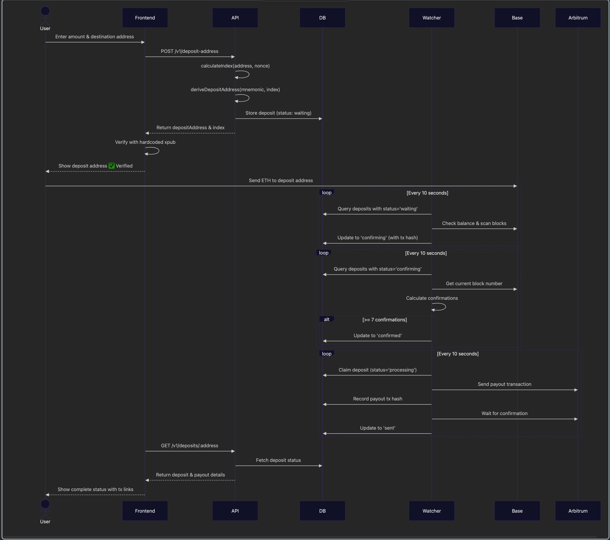

# Custodial Bridge: Base Sepolia → Arbitrum Sepolia

---

## Table of Contents

- [Architecture Overview](#architecture-overview)
- [Derivation Specification](#derivation-specification)
- [Setup Instructions](#setup-instructions)
- [Running the Bridge](#running-the-bridge)
- [Testing the Flow](#testing-the-flow)
- [Known Limitations](#known-limitations)

---

## Architecture Overview

### System Components


### Flow Sequence




## Derivation Specification

### Index Calculation Algorithm

The bridge uses deterministic index generation to ensure:
1. Same destination address + nonce always produces the same deposit address
2. Different destination addresses produce unpredictable, non-sequential indices
3. Multiple deposit addresses per user (via nonce parameter)

**Algorithm:**

```typescript
import { keccak256, toBytes, hexToNumber, type Hex } from 'viem';

export function calculateIndex(destinationAddress: string, nonce: number): number {
  const combined = `${destinationAddress.toLowerCase()}-${nonce.toString()}`;
  const hash = keccak256(toBytes(combined));

  return hexToNumber(hash.slice(0, 8) as Hex); // take first 3 bytes (0x + 6 hex chars)
}
```

**What this does:**
1. Normalizes address to lowercase: `destinationAddress.toLowerCase()`
2. Constructs input: `"<lowercase-address>-<nonce>"` with dash separator
3. Encodes as UTF-8 bytes and hashes with keccak256
4. Takes first 8 characters of hash (includes "0x" prefix) = first 3 bytes
5. Converts to integer: 0 to 16,777,215 (2²⁴ - 1)

**Why this pattern?**

The concatenation pattern `${destinationAddress.toLowerCase()}-${nonce.toString()}` is carefully designed for:

1. **Case-insensitive determinism**: Ethereum addresses can be written in different cases (lowercase, checksummed EIP-55, or mixed). Lowercasing ensures the same Ethereum address always produces the same index regardless of input format:
   ```typescript
   // Without lowercase: different cases → different hashes
   hash("0xAbC123...-0") → index 12345
   hash("0xabc123...-0") → index 67890  // Different!
   
   // With lowercase: always consistent
   hash("0xabc123...-0") → index 12345
   hash("0xabc123...-0") → index 12345  // Same ✓
   ```

2. **Unambiguous concatenation**: The dash separator prevents collision between different input combinations:
   ```typescript
   // Without separator:
   address="0xabc1", nonce=23  → "0xabc123"
   address="0xabc", nonce=123  → "0xabc123"  // Collision! ✗
   
   // With separator:
   address="0xabc1", nonce=23  → "0xabc1-23"
   address="0xabc", nonce=123  → "0xabc-123"  // Unique ✓
   ```

3. **Human-readable**: The pattern `"0xabc...-0"` is easy to understand and verify manually, unlike binary encodings or complex serialization formats.

### HD Wallet Derivation Path

Once the index is calculated, the deposit address is derived using BIP32:

```
m/44'/60'/0'/0/index
│   │   │   │  │  │
│   │   │   │  │  └─ Calculated index (0-16,777,215)
│   │   │   │  └──── Change (always 0)
│   │   │   └─────── Account (always 0)
│   │   └──────────── Ethereum (coin type 60)
│   └──────────────── Purpose (BIP44)
└──────────────────── Hardened root
```

**Implementation:**

```typescript
import { mnemonicToAccount } from 'viem/accounts';
import type { Address, HDAccount } from 'viem';

function deriveDepositAddress(
  mnemonic: string,
  index: number
): { address: Address; account: HDAccount } {
  // viem's mnemonicToAccount handles the full BIP32 derivation internally
  // Path used: m/44'/60'/0'/0/{index}
  const account = mnemonicToAccount(mnemonic, {
    accountIndex: 0,    // m/44'/60'/0'
    changeIndex: 0,     // m/44'/60'/0'/0
    addressIndex: index // m/44'/60'/0'/0/{index}
  });

  return {
    address: account.address,
    account
  };
}
```

**What happens internally:**
1. Mnemonic → Seed (using BIP39)
2. Seed → Master key (BIP32)
3. Derive child key at path `m/44'/60'/0'/0/{index}`
4. Extract public key from child key
5. Compute Ethereum address: `keccak256(publicKey)` → last 20 bytes

## Setup Instructions

### Prerequisites

- **Node.js** 18+ and Yarn
- **Supabase** account (free tier works)
- **Base Sepolia** and **Arbitrum Sepolia** RPC URLs (Alchemy/Infura)
- **Testnet ETH** for gas fees

### 1. Clone and Install

```bash
git clone <your-repo>
cd custodial-bridge
yarn install
```


### 2. Configure Environment Variables

Create `.env.local` files:

**apps/bridge-app/.env.local** (API & Frontend)
```bash
# Database
NEXT_PUBLIC_SUPABASE_URL=https://your-project.supabase.co
NEXT_PUBLIC_SUPABASE_ANON_KEY=your-anon-key
SUPABASE_SERVICE_ROLE_KEY=your-service-role-key

# Bridge Configuration
BRIDGE_MNEMONIC="your twelve word mnemonic phrase here"
BASE_RPC_URL=https://base-sepolia.g.alchemy.com/v2/YOUR-KEY
ARBITRUM_RPC_URL=https://arb-sepolia.g.alchemy.com/v2/YOUR-KEY

# Frontend Verification
NEXT_PUBLIC_BRIDGE_XPUB="xpub6C..." # Derive from your mnemonic
```

**apps/watcher/.env** (Watcher Service)
```bash
# Database
SUPABASE_URL=https://your-project.supabase.co
SUPABASE_SERVICE_ROLE_KEY=your-service-role-key

# Bridge Configuration
BRIDGE_MNEMONIC="your twelve word mnemonic phrase here"
BASE_RPC_URL=https://base-sepolia.g.alchemy.com/v2/YOUR-KEY
ARBITRUM_RPC_URL=https://arb-sepolia.g.alchemy.com/v2/YOUR-KEY

# Watcher Settings
REQUIRED_CONFIRMATIONS=7
POLL_INTERVAL=10000  # 10 seconds
```

### 3. Generate Extended Public Key (xpub)

```typescript
// scripts/generate-xpub.ts
import { HDKey } from '@scure/bip32';
import { mnemonicToSeed } from '@scure/bip39';

const mnemonic = "your twelve word mnemonic";
const seed = await mnemonicToSeed(mnemonic);
const masterKey = HDKey.fromMasterSeed(seed);
const accountKey = masterKey.derive("m/44'/60'/0'/0");

console.log("XPUB:", accountKey.publicExtendedKey);
```

Add this xpub to `NEXT_PUBLIC_BRIDGE_XPUB` in frontend env.

### 5. Setup Database

```bash
# Run Supabase migrations
cd supabase
supabase db push
```

---

## Running the Bridge

### Development Mode

**Terminal 1: Frontend + API**
```bash
cd apps/bridge-app
yarn dev
# Runs on http://localhost:3000
```

**Terminal 2: Watcher**
```bash
cd apps/watcher
yarn dev
# Polls every 10 seconds
```
---

## Testing the Flow


https://github.com/user-attachments/assets/3c0def89-5597-4a80-98cd-6e0285464df0


## Known Limitations

This is an MVP implementation demonstrating core concepts. The following limitations are known and would need addressing for production use:

### Stuck Processing Deposits

**Issue:** If the watcher crashes after claiming a deposit (status='processing') but before recording the payout transaction hash, the deposit becomes orphaned.

**Why:** The watcher only queries `deposit_status IN ('confirmed', 'processing')` but has no timeout mechanism to reset stale processing deposits.

**Impact:** Requires manual database intervention to recover stuck deposits.

**Production Fix:** Implement a timeout/lease mechanism:
- Add `processing_started_at` timestamp
- Reset deposits to 'confirmed' if processing for >10 minutes
- Add heartbeat updates during long-running operations

---

## License

MIT

---

